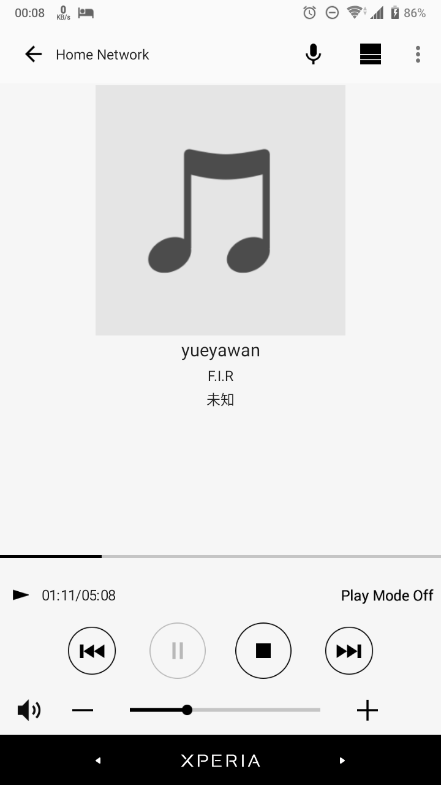

# SONY SRS-HG2 DLNA - NODE CLIENT

## Introduction

迫于手机网易云DLNA播放总是卡壳，windows 10只有自带media player可用，遂尝试

## Discover Device

```python
python index.py
```


取得xml location

## Play Music

```node
node index.js  // 播放测试音乐
```




## Reference

> https://stackoverflow.com/questions/19106672/how-to-implement-ssdp-upnp-trying-to-use-sonys-camera-api

> https://developer.sony.com/develop/audio-control-api/get-started/play-dlna-file